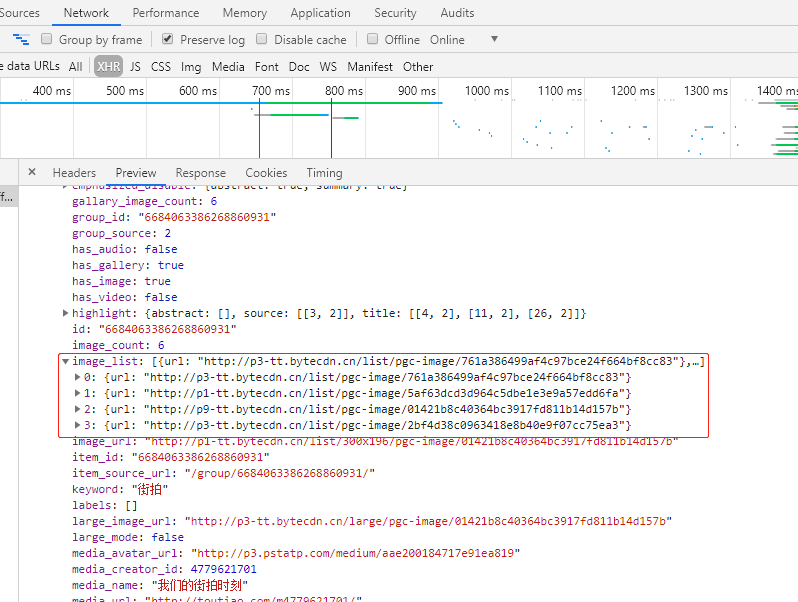
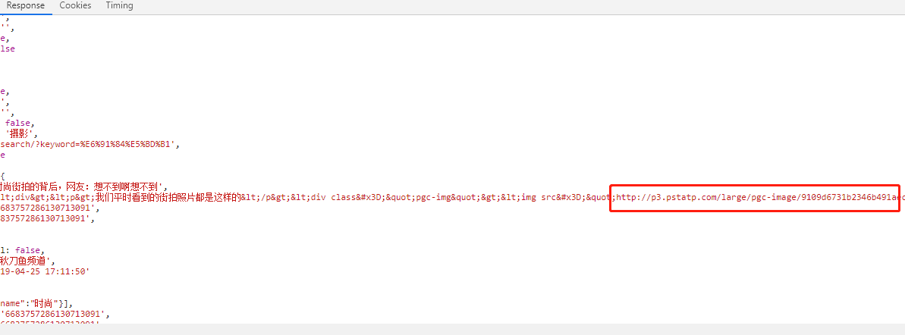
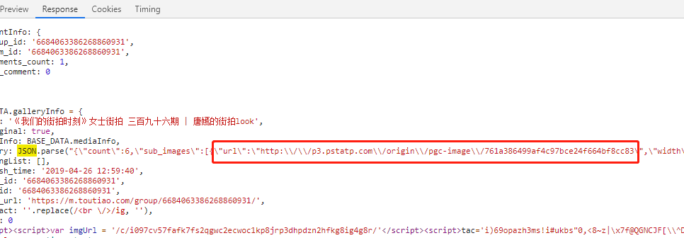

### Ajax 分析爬取今日头条街拍美图

- **准备工作**
    - python3.6
    - MongoDB 
    - requets
    - pymongo
    
- **分析过程**
    - 逆向思维：需求分析，需要爬取图片，那么就需要找到图片链接地址
      搜索框搜索 "街拍" , 打开开发者选项:Network:XHR
      下拉进度条，Ajax异步加载数据，点击Preview查看分析数据
      
      url_list 里的url不全，而且图片不是高清大图，因此，需要到详图里面去提取图片的url
      详图有两种情况：一种是所有图片在一个面页面内的单面式；另一种是图集式。两种排版的response body格式不一样
      因此，要分别提取
      
      
      
    
    - 可以通过abstract来区分,abstract为空的就是图集排版， 然后利用正则表达式提取图片的url